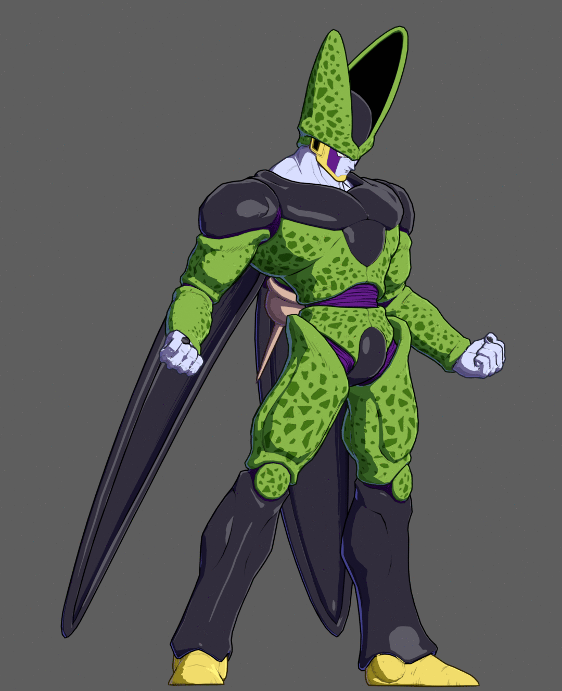

# Arc System Works Shader - Blender Edition PLEASE READ VERSION NUMBER FOR REQUIRED BLENDER VERSION!
## [BLENDER MAIN VERSION].[SECONDARY].[TERTIARY].[SHADER VERSION]
## Older versions of Blender can be found under the revision history
## If you are looking for my Unity Arc System Works shaders, they are found here:
https://github.com/Aerthas/UNITY-Arc-system-Works-Shader 
Youtube playlist detailing how to set up models and usage of the shader: [Link to playlist here](https://www.youtube.com/playlist?list=PLCkHUM_E60CSi1HowXR3v4uVWNqUDsl9l) 
If you have any questions, or want to show off some renders, [feel free to join my discord](https://discord.gg/EkCSZg8). 
The following are renders using the shader in Blender 3.0 Eevee.

 
 
 
 

Still a work in progress
Based on my Unity shader, but due to limitations of Blender nodes there is no control on the outline thickness that the Unity shader has. 
